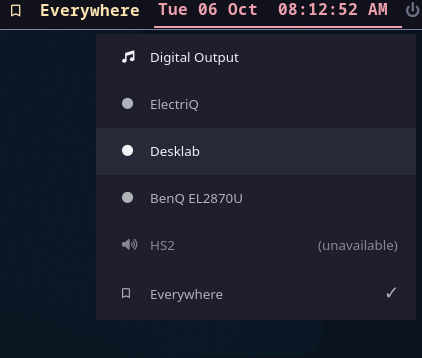

# pipewire-waybar

A C++ PipeWire client + Waybar widget for managing audio sinks on Hyprland (or
any wlroots compositor). Define your sinks in a config file with friendly
names — including virtual sinks that mirror to multiple devices — and switch
between them from the bar with one click.

## Why

PipeWire's default sink is per-device-name and changes silently when devices
come and go (HDMI hotplug, Bluetooth connect/disconnect, USB unplug). When you
have several outputs (HDMI, optical, USB DAC, Bluetooth headphones) routing
audio to "the right one" without fiddling in `pavucontrol` is tedious. This
project gives each sink a stable friendly name, persists the user's choice,
re-applies it across hotplugs, and lets you flip between them from Waybar.

So, all I wanted to do - is to have a simple toobar to control which sound sink
the sound plays on. The number of times I have to scrabble to use pavucontrol to
change the sound sink for Zoom or whatever was too many..

## Architecture

Three executables sharing a small common library:

```
                              D-Bus session bus
                              org.pipewire_waybar.Sink1
   ┌──────────────────────────────────┴──────────────────────────────────┐
   │                                                                     │
┌──┴───────────────┐         ┌────────────────────┐         ┌────────────┴──────┐
│ pipewire-waybard │  ◄────► │ pipewire-waybar   │ ◄────► │ pipewire-waybar- │
│ (daemon)          │         │ (CLI + waybar feed)│         │ picker (GTK4)     │
└──────────┬───────┘         └────────────────────┘         └───────────────────┘
           │
           │ libpipewire-0.3
           ▼
        PipeWire
```

- **Daemon** (`pipewire-waybard`): connects to PipeWire, tracks sinks and
  streams, manages `module-combine-stream` for virtual sinks, enforces the
  chosen sink (sets default + moves existing streams), persists the choice,
  and exposes a D-Bus interface for clients.
- **CLI** (`pipewire-waybar`): subcommands for scripting (`list`, `get`,
  `set`, `reload`, `generate-config`) and the Waybar-facing JSON producer
  (`watch`).
- **Picker** (`pipewire-waybar-picker`): GTK4 layer-shell popup that lists
  available sinks and calls `SetChosen` on click. Designed to be invoked from
  the Waybar widget's `on-click`.

The D-Bus interface is in `include/pipewire-waybar/dbus_interface.h`.

## Config

Path: `$XDG_CONFIG_HOME/pipewire-waybar/config.json` (or
`~/.config/pipewire-waybar/config.json`). See `config.example.json`. Generate
a baseline from your current PipeWire graph:

```
pipewire-waybar generate-config --out ~/.config/pipewire-waybar/config.json
```

Each sink has a friendly `name`, a PipeWire `node_name`, and a `type` (used
to pick an icon). `virtual_sinks` define multi-output combinations — the
daemon spawns a `module-combine-stream` per virtual sink with the listed
members. `default` names the sink to use on first run; subsequent choices are
persisted to `$XDG_STATE_HOME/pipewire-waybar/state.json`.

## Build & install

Dependencies: CMake ≥ 3.25, a C++20 compiler, `libpipewire-0.3`,
`sdbus-c++ ≥ 2.0`, `nlohmann_json ≥ 3.10`, and (for the picker) `gtk4` and
`gtk4-layer-shell`.

```
cmake -B build -S .
cmake --build build
sudo cmake --install build
```

Pass `-DBUILD_PICKER=OFF` if you don't want the GTK4 dependency.

A `pipewire-waybar.service` user unit is installed to
`$prefix/lib/systemd/user/`. Enable it with:

```
systemctl --user enable --now pipewire-waybar
```

## Usage

`list` shows every configured sink with its type and PipeWire node name. `*`
marks the chosen sink, and `(unavailable)` marks sinks that aren't currently
present (e.g. a Bluetooth headset that's switched off):

```
$ pipewire-waybar list
  [spdif] Digital Output  -- alsa_output.pci-0000_7b_00.6.iec958-stereo
  [hdmi] ElectriQ  -- alsa_output.pci-0000_03_00.1.pro-output-8
  [hdmi] Desklab  -- alsa_output.pci-0000_7b_00.1.hdmi-stereo
  [hdmi] BenQ EL2870U  -- alsa_output.pci-0000_03_00.1.pro-output-3
  [unknown] HS2 (unavailable)  -- bluez_output.24_09_01_FD_40_3E.1
* [virtual] Everywhere  -- phc_combine_everywhere
```

Get or switch the chosen sink by its friendly name (quote names with spaces).
The daemon picks up config edits automatically; `reload` forces a re-read:

```
$ pipewire-waybar get
Everywhere
$ pipewire-waybar set "BenQ EL2870U"
$ pipewire-waybar reload
```

## Waybar integration

Drop the snippet from `contrib/waybar-config-snippet.jsonc` into your bar's
config. It runs `pipewire-waybar watch` to stream JSON updates and binds
`on-click` to `pipewire-waybar-picker`. Style classes (`hdmi`, `usb`,
`bluetooth`, `unavailable`, `flash`, …) are emitted on the widget so you can
theme via `style.css`.



The widget shows the currently chosen sink ("Everywhere" above). Hover over
it for a tooltip listing every sink and its state; click it to open the
picker:

- Each configured sink is listed with an icon for its type (`hdmi`, `spdif`,
  `bluetooth`, `virtual`, …) and a ✓ next to the one currently chosen.
- Click a sink to switch to it. The daemon makes it the default and moves
  every playing stream onto it, and new streams follow it too. The picker
  closes and the widget updates.
- Choose a virtual sink such as "Everywhere" to play on all of its members
  at once.
- Sinks that aren't present right now (e.g. "HS2", a Bluetooth headset that's
  switched off) are greyed out and marked `(unavailable)`. They become
  selectable as soon as the device appears, and the widget briefly flashes to
  let you know.
- Hover a row to see its type and PipeWire node name.
- Press <kbd>Esc</kbd> or click outside the list to close without changing
  anything.

## Layout

```
src/
  common/   shared types, config loader, state store, logger
  daemon/   pipewire-waybard — PipeWire client, router, D-Bus server
  cli/      pipewire-waybar  — subcommands + waybar JSON producer
  picker/   pipewire-waybar-picker — GTK4 layer-shell sink chooser
include/pipewire-waybar/   public D-Bus interface constants (consumed by all three binaries)
contrib/  systemd unit template, waybar snippet
data/     example styling
```

Each `src/*` directory has its own README with the per-component details.
